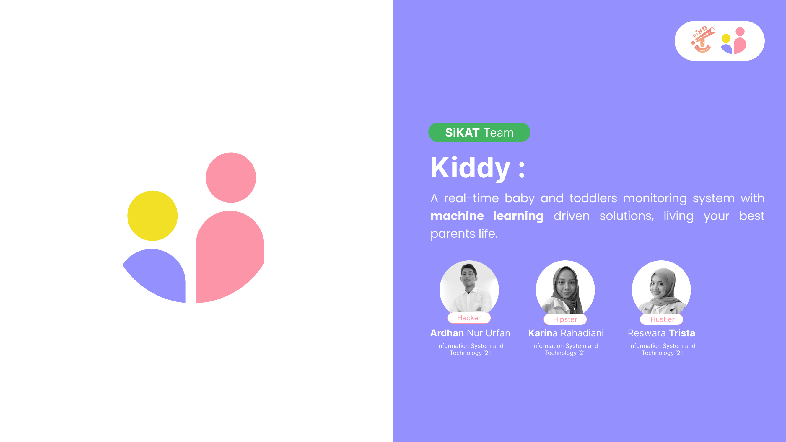
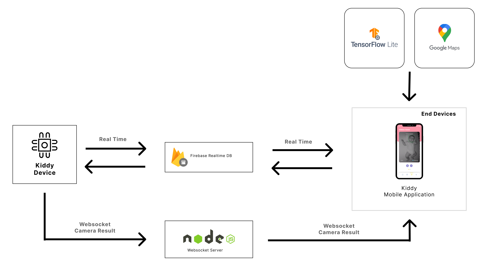
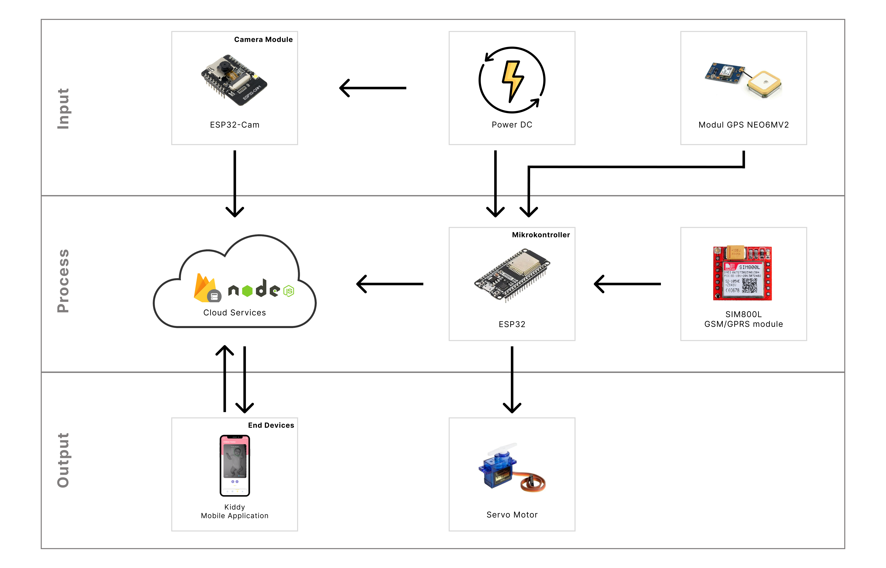

<h1 align="center">
   Kiddy Mobile Application
</h1>

<p align="center">
  
</p>

<hr>

## Links

> You can access this project **Presentation Document** [here]().

> You can access this project **Presentation Video** [here]().

> You can access the **Mobile App** repository [here](https://github.com/SiKAT-FindIT/kiddy).

> You can access the **IoT Devices Code** repository [here](https://github.com/SiKAT-FindIT/kiddy_iot).

> You can access the **IoT Websocket Server** repository [here](https://github.com/SiKAT-FindIT/kiddyserver).

## Table of Contents

1. [General Information](#general-information)
2. [Technologies Used](#technologies-used)
3. [Installation](#installation)
4. [Our Team](#team)
5. [Copyright](#copyright)

<a name="general-information">

## General Information

A real-time baby and toddlers monitoring system with machine learning driven solutions, living your best parents life. This application has many features:

-
-
-

<a name="technologies-used"></a>

## Technologies Used

This project using some technologies :

- Flutter 3.19.5 with Dart 3.3.3
- Web Socket
- Firebase
- NodeJs
- Tensorflow Lite
- Google Maps API

### Architecture of Kiddy System

<p align="center">
  
</p>

### Architecture of Kiddy IoT Device

<p align="center">
  
</p>

<a name="installation">

## Installation

Then, run the development server:

Install all dependencies

```bash
flutter pub get
```

and run debugger on your IDE

<a name="team">

## Our Team

| Nama                        | E-Mail                      |
| --------------------------- | --------------------------- |
| Ardhan Nur Urfan            | 18221118@std.stei.itb.ac.id |
| Reswara Trista Candrakanthi | 18221122@std.stei.itb.ac.id |
| Karina Rahadiani            | 18221104@std.stei.itb.ac.id |

<a name="copyright"></a>

## Copyright

<h4 align="center">
  Propose for FindIT 2024 by SiKAT Team. Copyrights @2024
</h4>

</hr>
